## Welcome to Dispatch-Bifrost CI pages 

Here are the results from the last run associated with 
**Dispatch-Bifrost merge_split, build #1**

## Brio & Wu results

  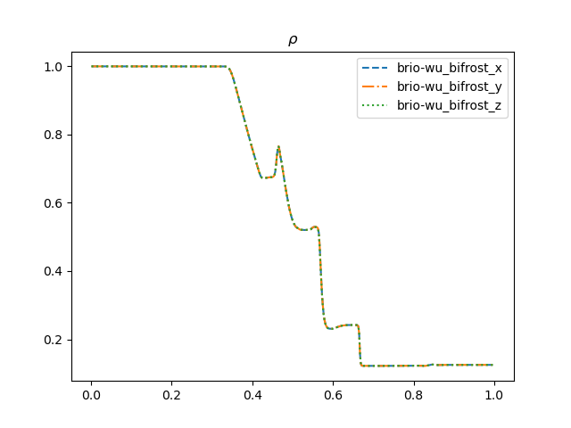{: style="width:400px"}
  {: style="width:400px"}
  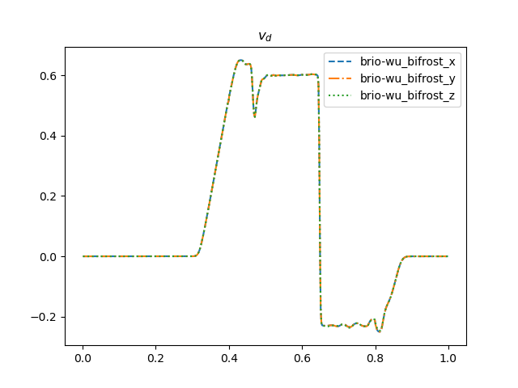{: style="width:400px"}
  
  **[Comparison to reference](tables/brio-wu.md)**

## Sod shock tube comparison to analytical results

  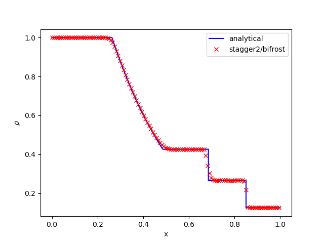{: style="width:400px"}
  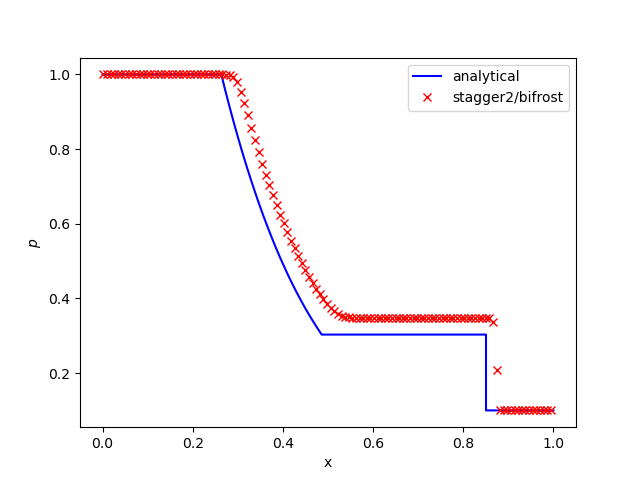{: style="width:400px"}
  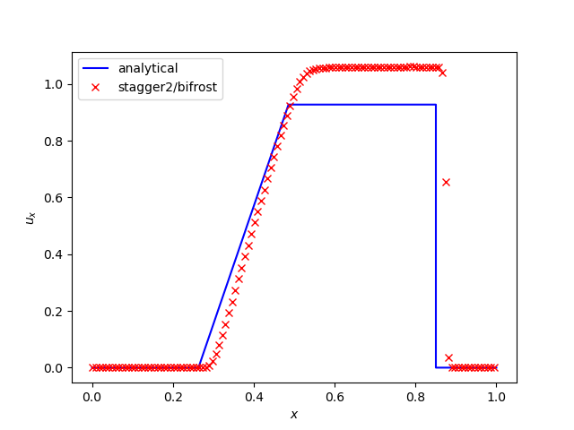{: style="width:400px"}

## Advection of a Magnetic Field Loop 

  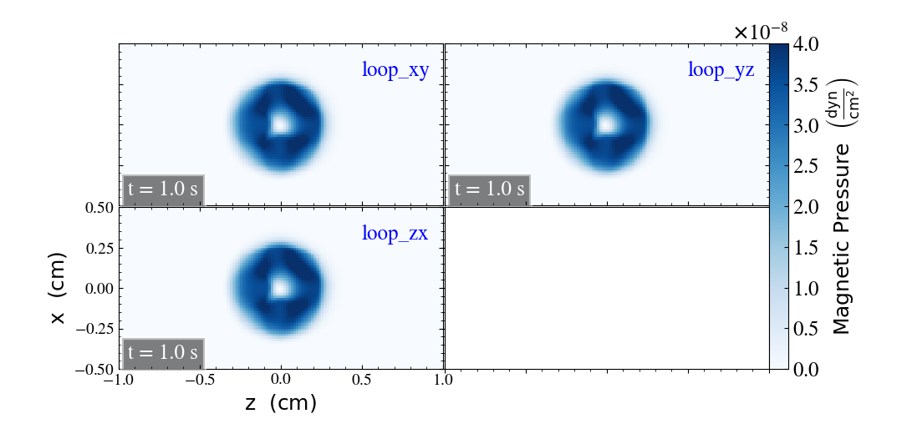
  
  **[Comparison to reference](tables/MagLoopAdvection.md)**

## Orszag Tang energy conservation

  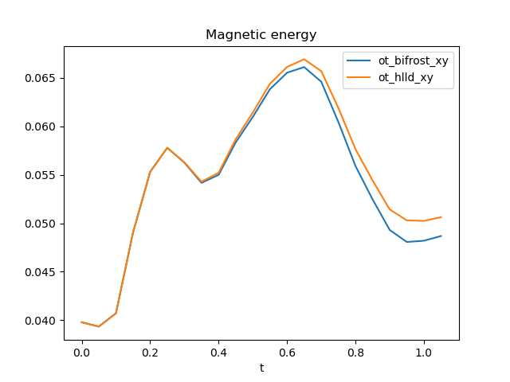{: style="width:400px"}
  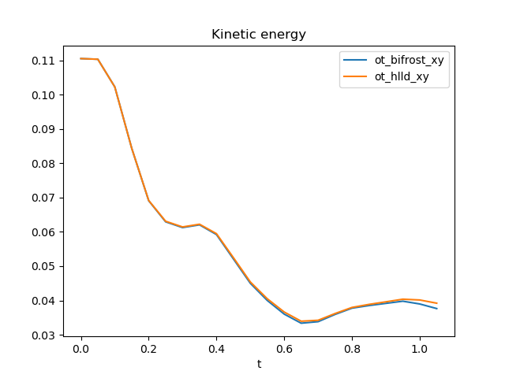{: style="width:400px"}
  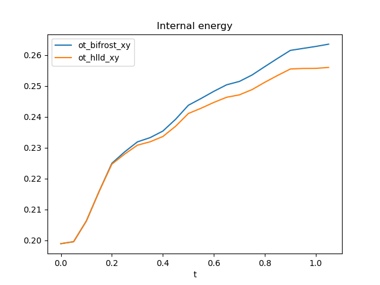{: style="width:400px"}
  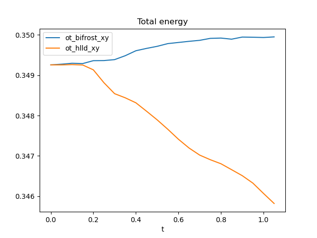{: style="width:400px"}
  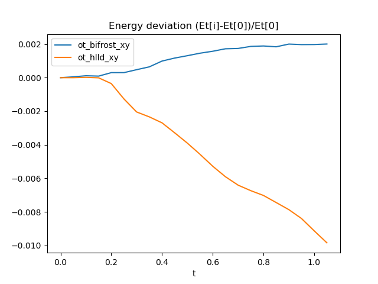{: style="width:400px"}
  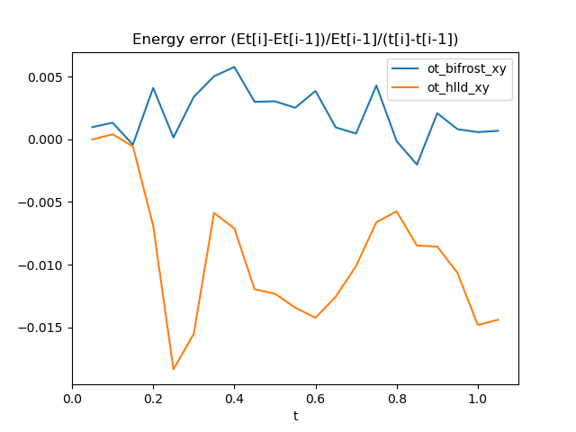{: style="width:400px"}
   

## Stdout on Jenkins terminal
  - [Link to output](output_file.txt)
  

